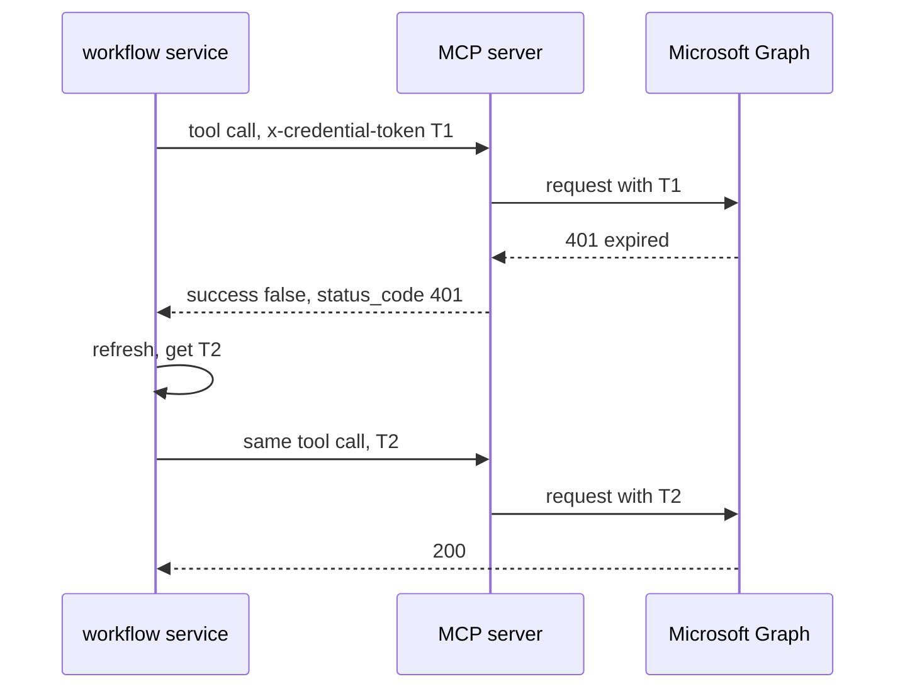

# Proactive and Reactive OAuth Token Refresh

Whoever owns the OAuth connection owes the refresh, and it should be both:

- **Proactive** — before injecting, if the token expires within about five minutes, refresh first. This handles almost every case.
- **Reactive** — if a call comes back 401, refresh once and retry. This catches clock skew, revoked sessions and admin-forced sign-out.

Retrying is safe here because a 401 means the API rejected the request before doing anything — no risk of a double write.

Two details that trip people up. The **MCP call itself returns HTTP 200**; the 401 lives inside the response body, because it describes what Graph said rather than what the MCP server said. And nothing new has to be built for this — `graph_request()` already passes Graph's `status_code` through.

MFA is not part of the refresh loop. It happens once, at the initial interactive connect, and the claim carries forward. What does send a user back through it: Conditional Access **sign-in frequency** (commonly 7 or 14 days), 90 days of inactivity, a password change, or an admin revoking sessions. When refresh fails with `invalid_grant`, the workflow service should mark that connection disconnected and prompt a reconnect rather than failing the workflow with a generic error.
