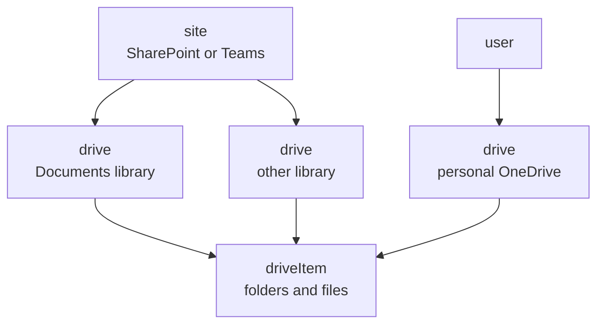

# Sites, Drives and driveItems in Microsoft Graph

A site contains drives; a drive contains files. Every file lives in some drive, and every drive sits on some site — including personal OneDrive, which sits on that user's own personal site.



That is why `Sites.ReadWrite.All` granted app-only also reaches personal OneDrive: a personal drive is a site collection like any other.

| Scope family | Thinks in units of |
| --- | --- |
| `Files.*` | driveItems — individual files, wherever they live, including ones shared with the user |
| `Sites.*` | sites — the container, and therefore everything in all of its libraries |

Uploads always land in a drive. There is no `PUT /sites/{id}/content`; the site-level path is just a shortcut to that site's default library.

```
PUT /me/drive/root:/report.xlsx:/content                           own OneDrive
PUT /sites/{site-id}/drive/root:/report.xlsx:/content              site's DEFAULT library
PUT /sites/{site-id}/drives/{drive-id}/root:/report.xlsx:/content  a named library
```

A site usually has several libraries, and `/drive` silently picks the default — so a file can land somewhere the user did not mean. When a workflow names a library, resolve it through `/sites/{id}/drives` and use the explicit drive id.
