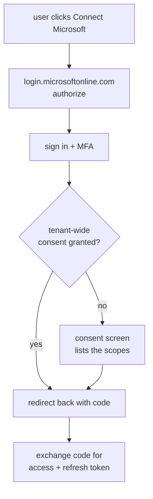

# client_id Selects the App on the Consent Screen

With tenant-wide admin consent the consent screen never appears. The user signs in and lands straight back in the calling platform. That is the practical payoff of the admin ask — not merely "it is allowed", but that nobody is shown a dialog reading *Have full access to all files you have access to*.

Without it, the screen appears mid-flow on Microsoft's own page:



**`client_id` is what selects the app.** Entra looks up that GUID and renders that registration's name, logo and publisher, listing the scopes from `scope=`. Nothing about the code or the server is involved.

```
login.microsoftonline.com/{tenant}/oauth2/v2.0/authorize
  ?client_id=<one GUID>
  &scope=Files.ReadWrite.All Sites.Read.All offline_access
  &redirect_uri=<must already be registered on that app>
```

Exactly one `client_id` per request — it is never a list. Scopes are the thing you list. Two registrations means two independent connect flows and two stored refresh tokens.

The client id and tenant id are **public**: they travel in browser URLs on every sign-in. The client secret, certificates and tokens are the secrets.

A registration can be shared across deployments — that is how FTEL-HRAI reached 35 redirect URIs. Outsiders cannot abuse a known client id, because the redirect URI must already be registered and adding one requires being an owner. But reusing it means the consent screen shows the union of every scope, consent state is shared, rotating one secret can break an unrelated deployment, and sign-in logs blend together.

**Register a separate app** rather than reusing one. Three clean scopes is a far easier conversation with the admin than adding file-write power to the app that already does everything, and it cannot break the existing flows.

Useful later: `prompt=consent` in the authorize URL forces the screen to reappear. Needed when a scope is added, because existing users otherwise keep their old token and the new scope silently does nothing.

The admin's own one-time grant can be done from a URL, which is usually easier than walking them through the portal blades:

```
https://login.microsoftonline.com/{tenant}/adminconsent?client_id=<the new app>
```
